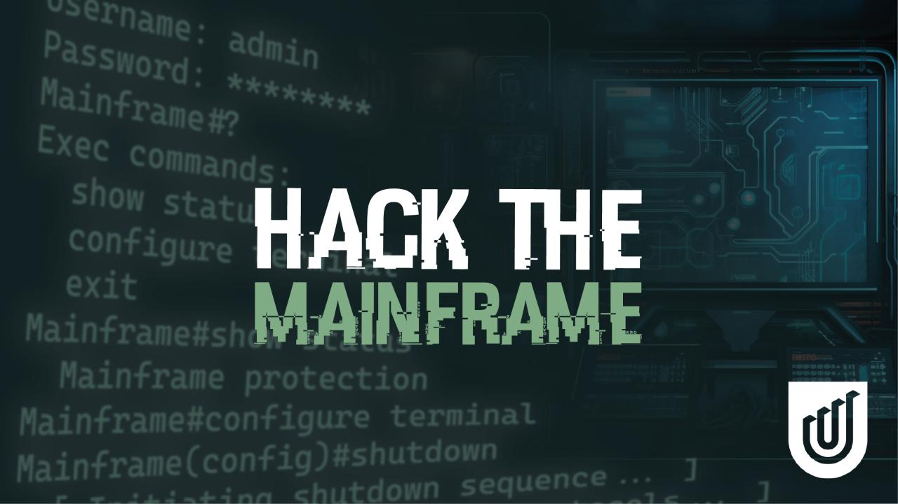
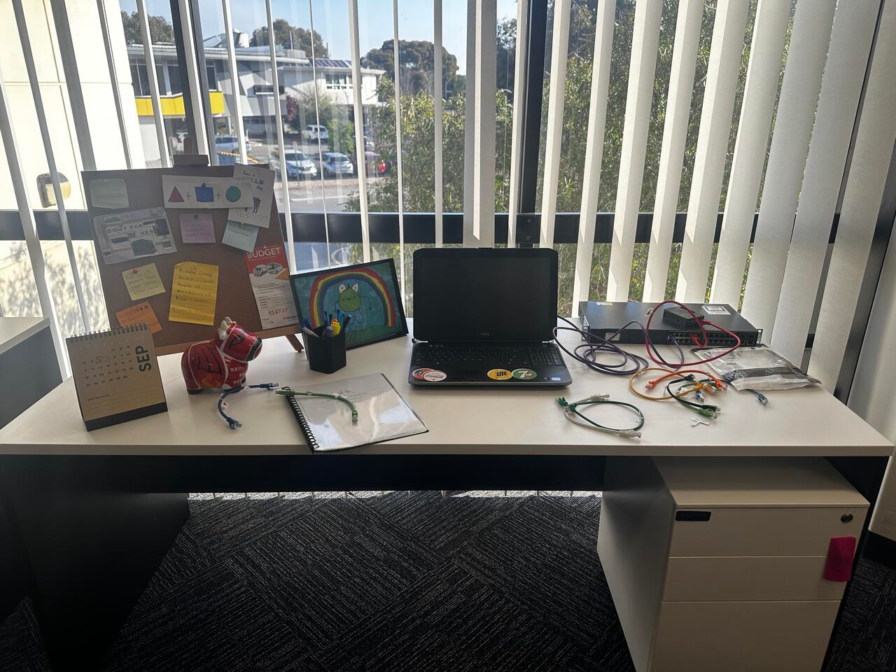
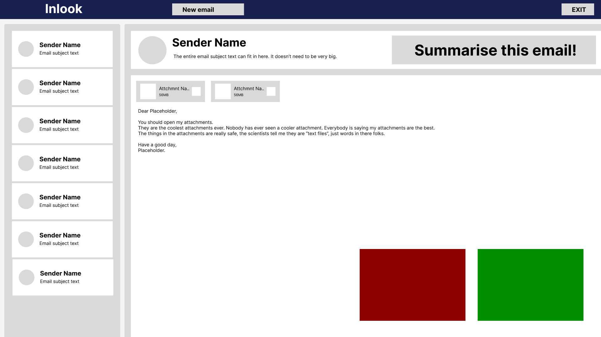
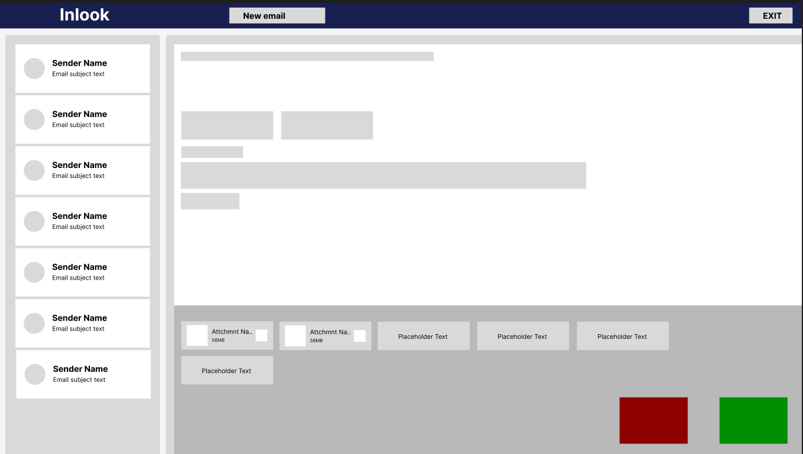
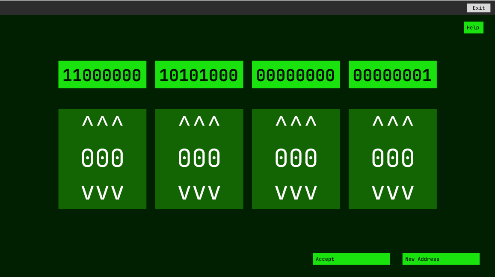
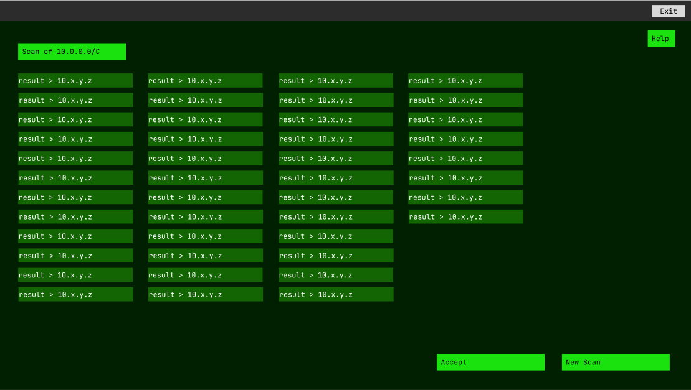

  

<h3 align="center"><code>$ ¯\_(ツ)_/¯ idk.cyber experiences</code></h3>

# A development group at Adelaide University · <a href="https://about.idk.cx">about.idk.cx</a>

---

### `$ cat about.txt`

We build cyber experiences to have fun with, I guess.

idk is a small development group founded by Adelaide University Networking & Cyber Lecturers Joel Dellar & Ellie Parker.

We develop bespoke cybersecurity activities that can be fun to those of all ages by abstracting away technical complexities and replacing them with gamified interfaces. Our workshops are geared to High School Students in years 9-12, but can be enjoyed by those of all ages.

We also intend to develop realistic Red Team / Blue Team scenarios using Adelaide Universities own Cyber Range, the CyberLab.

Analytics collected during the activities is intended to be used in future research data. No analytical data is currently being collected.

### `$ ls experiences/`

#### Hack the Mainframe · `running`

A CyberSecurity Escape Room. Hacking Group "nAiSU" has tasked you with breaking into Vault 101 at UniBank.

Your team has broke into the building, and into the office of Network Engineer Christopher Wallace. Can you get onto Chris' Laptop, and find a way to turn off UniBank's Protection System?

 the network engineer's office - spot where the laptop password is

#### Operation PowerOUT · `coming soon` · Powered by the CyberLab

You work as a Cyber Specialist for an IT Solutions Organisation that is about to run out of business. You have one last hope - getting the support contract of "UniBank", who are upping their internal security policies after a recent break in.

The issue: other IT Solutions Organisations are also competing for the contract. Your goal is to hack into the other Organisations, and shut off their data centre, so your organisation is seen as the best candidate.

<table>
  <tr>
    <td align="center"> phishing: receive</td>
    <td align="center"> phishing: send</td>
  </tr>
  <tr>
    <td align="center"> binary ↔ decimal</td>
    <td align="center"> subnet recon</td>
  </tr>
</table>

### `$ who`

| # founders | # interns · powerout | # alumni |
|---|---|---|
| [Joel Dellar](https://www.linkedin.com/in/joeldellar/) | [Daniel Hoffmann](https://www.linkedin.com/in/daniel-hoffmann-830961306/) | [Henry Ponte](https://www.linkedin.com/in/henry-ponte/) |
| [Ellie Parker](https://www.linkedin.com/in/eleanor-b-parker/) | [Nicholas Tatlian](https://www.linkedin.com/in/nicholas-tatlian-064028355/) | [Riordan Cassidy](https://www.linkedin.com/in/riordan-cassidy-82683924a/) |

### `$ cal`

coming soon…

---

   
  idk.cx · cyber experiences — Joel Dellar &amp; Ellie Parker · Adelaide University

